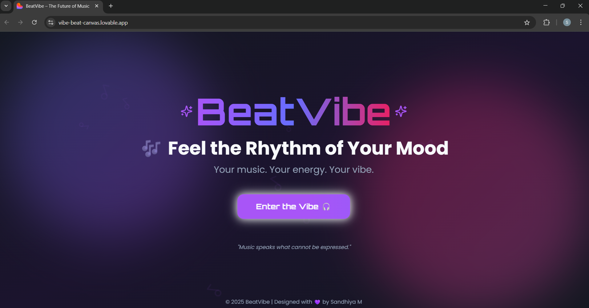
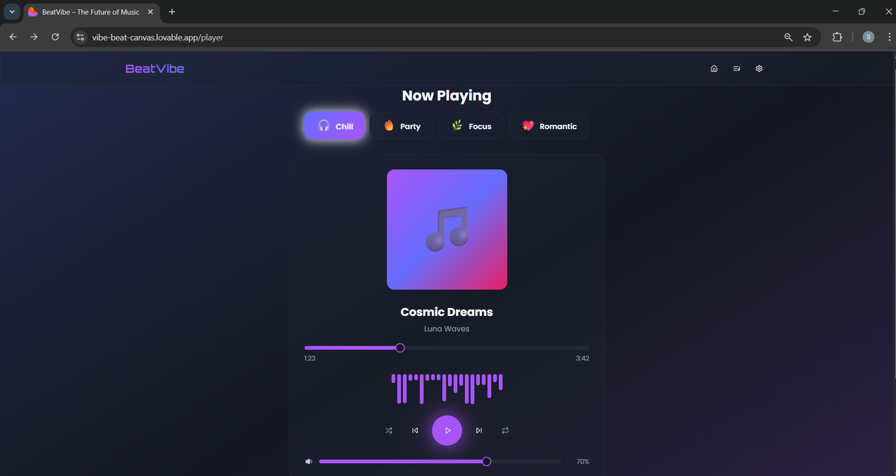
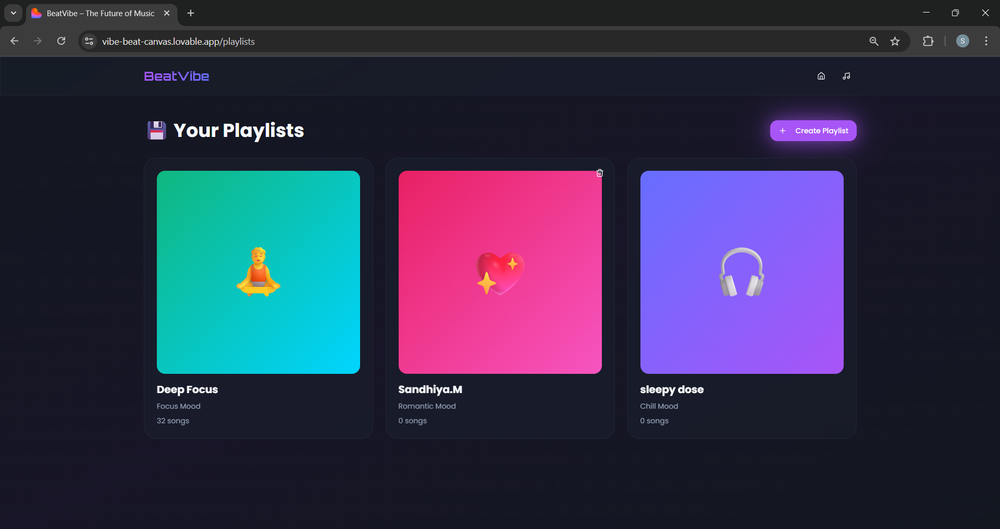
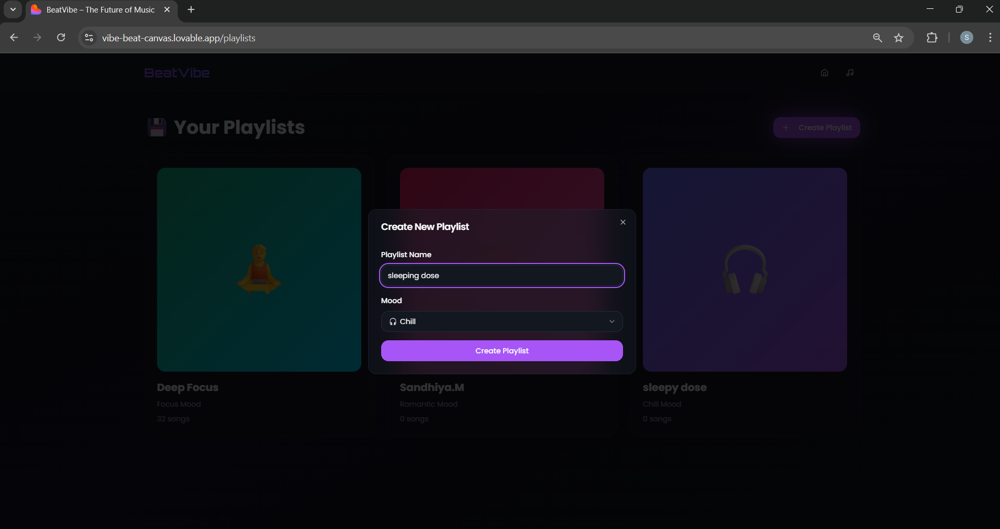

# 🎵 VibeBeats – Canvas Music Visualizer

## 📌 Project Info
VibeBeats is a web-based music visualizer that uses the **HTML5 Canvas API** to create dynamic, real-time animations that respond to audio frequencies.  
Users can upload any song, and the canvas will generate visual effects based on beats, bass levels, and waveform patterns.

---

## 🚀 Live Demo
🔗 **Demo Link:** *(https://vibe-beat-canvas.lovable.app)*

---

## ⭐ Features
- 🎧 **Upload & Play Any Audio File**
- 🔊 **Real-time Audio Frequency Analysis**
- 🌈 **Dynamic Canvas Animations**
- ⚡ **Smooth, High-Performance Rendering**
- 🎨 **Multiple Visualizer Styles (bars, waves, circles)**
- 📱 **Responsive Layout**

---

## 📸 Project Screenshots

### 🏠 Home Page

  

### ⚙ Music Page

  

### 🎨 Playlist Page

  

### ⚙ User-playlist Page

  

---

## 🧰 Tech Stack

### **Frontend**
- HTML5  
- CSS3  
- JavaScript (ES6)  

### **Web APIs Used**
- HTML5 Canvas  
- Web Audio API  

### **Tools**
- VS Code  
- Live Server  

---
